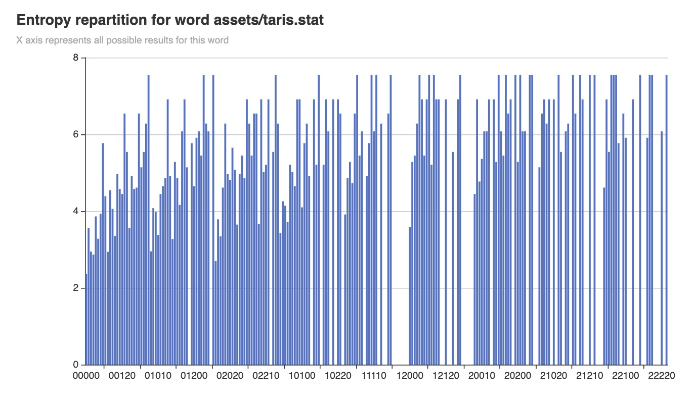

# wordlebot
This project propose a Wordle solver (french version)

## Introduction

This project is a golang version of [David Louapre's article]https://scienceetonnante.com/2022/02/13/comment-craquer-le-jeu-wordle-sutom/().

It uses a [french lexical(http://www.lexique.org/) database] (140.000 words with frequency in movies or books).
It will select only the 4096 most frequent 5 letters words as a playground (`cmd/extract`).

Then it will compute the best first guess word (`cmd/first`)
And eventually for each game pattern, will provide the best new guess (`cmd/guess`)


## How to use it

1. Download lexical dabase
```
cd assets
curl -O http://www.lexique.org/databases/Lexique383/Lexique383.tsv
```

2. Parse tsv
```
go run cmd/extract/main.go -d -l assets/Lexique383.tsv
```

3. Compute the best word to start with
```
go run cmd/first/main.go -d -l assets/words.txt
```

4. Visualize a word statistics
```
go run cmd/chart/main.go -d -l assets/taris.stat
open bar.html
```




## References

* http://www.lexique.org/
* https://scienceetonnante.com/2022/02/13/comment-craquer-le-jeu-wordle-sutom/
* https://www.youtube.com/watch?v=iw4_7ioHWF4&t=569s
* https://www.youtube.com/watch?v=fRed0Xmc2Wg