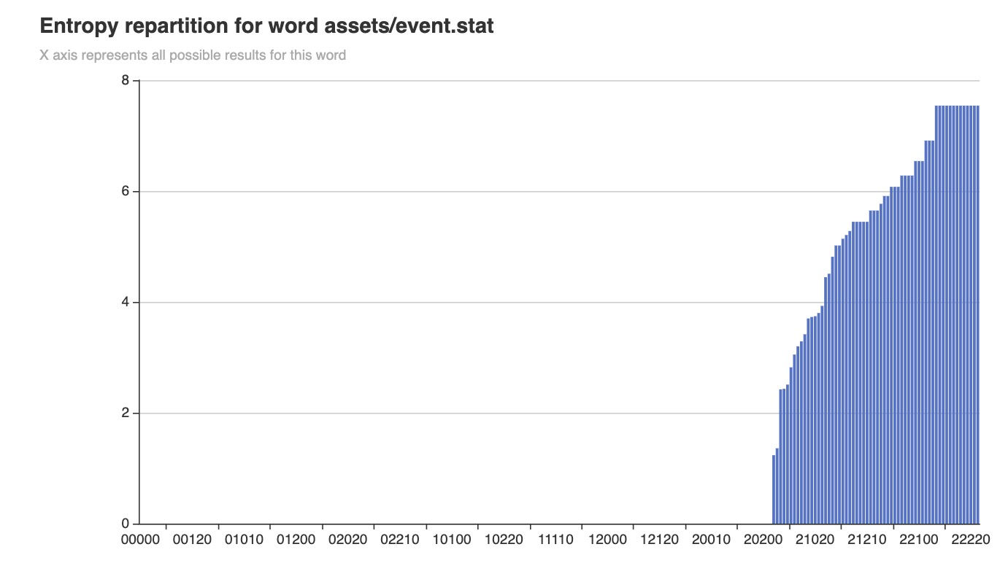
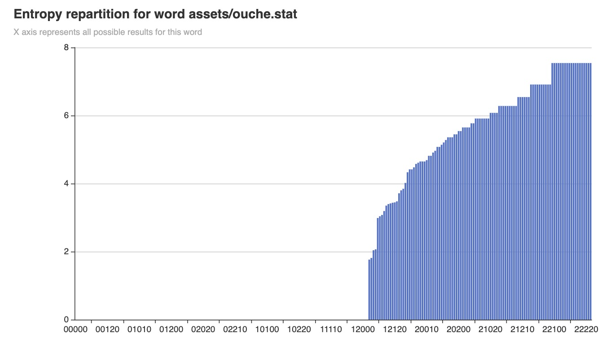
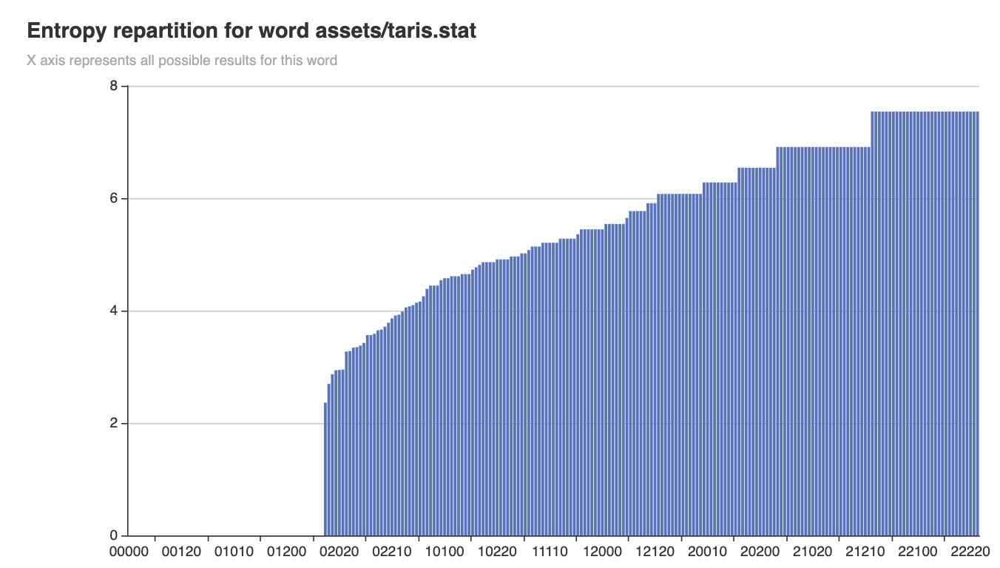
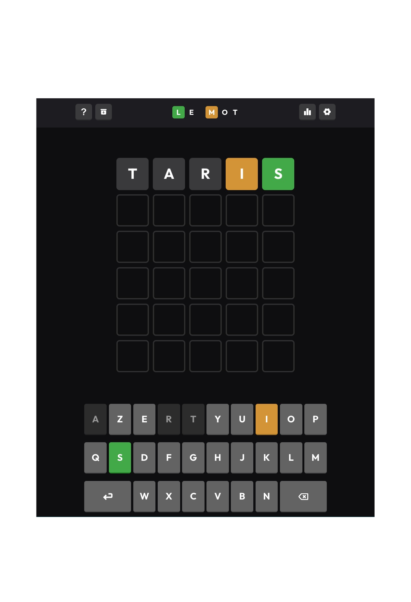
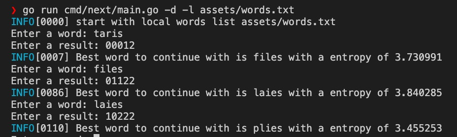
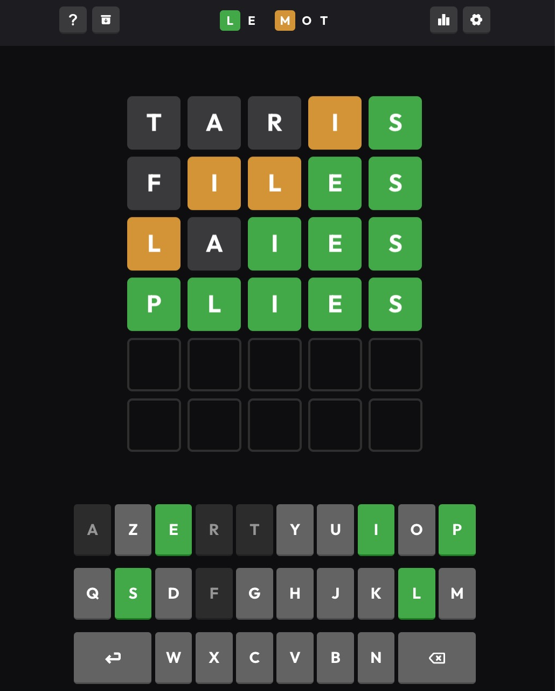

# wordlebot
This project propose a Wordle solver (french version)

## Introduction

This project is a golang version of [David Louapre's article](https://scienceetonnante.com/2022/02/13/comment-craquer-le-jeu-wordle-sutom/).

It uses a [french lexical database](http://www.lexique.org/) (140.000 words with frequency in movies or books).
It will select only the 4096 most frequent 5 letters words as a playground (`cmd/extract`).

Then it will compute the best first guess word (`cmd/first`)
And eventually for each game pattern, will provide the best word candidate to guess the daily word (`cmd/play`).


## How to use it

1. Download lexical database
```
curl -o assets/Lexique383.tsv http://www.lexique.org/databases/Lexique383/Lexique383.tsv
```

2. Parse tsv

This command will generate a `assets/word.txt` file with all valid  5 letters words.

```
go run cmd/extract/main.go -d -l assets/Lexique383.tsv
```

3. Compute the best word to start with

```
go run cmd/first/main.go -d -l assets/words.txt
INFO[0000] start with local words list assets/words.txt 
 100% |█████████████████████████████████████████████████████| (3965/3965, 19 it/s)           
INFO[0211] Best Word to start with is taris with a entropy of 4.429359 
```

4. Visualize a word statistics (optional)

This command generates a `bar.html` file you can open in your browser to visualize the repartition of information quantity (entropy) learned for each possible result during the game.

```
go run cmd/chart/main.go -d -l assets/taris.stat
open bar.html
```
Examples:

* `event` Entropy processing for each possible results:



* `ouche` Entropy processing for each possible results:



* `taris` Entropy processing for each possible results:



5. Run a game

Start a game on your browser (https://wordle.louan.me/)



Run the command:

```
go run cmd/play/main.go -d -l assets/words.txt
```

Then use the words suggested by `wordlebot` and enter the result provided by the game:

```
Enter a word: taris
Enter a result: 00012
INFO[0094] Best word to continue with is files with a entropy of 0.370403 
Enter a word: files
Enter a result: 001122
INFO[0094] Best word to continue with is laies with a entropy of 0.450421 
Enter a word: laies
Enter a result: 10222
INFO[0094] Best word to continue with is plies with a entropy of 0.396133 
```

Et voila !





6. Run the game simulator (optional)

This command will run the game engine against all playable words.
It will maintain a statistic of the average number of tries needed to guess a word.

Use `-m 10` option to limit the simulation to 10 words to guess.

```
go run cmd/simulator/main.go -d -l assets/words.txt -m 10
INFO[0000] start with local words list assets/words.txt
DEBU[0024] Try to guess word gadjo                      
DEBU[0024]      [0] guess: taris result: 02000 
DEBU[0028]      [1] guess: lagon result: 02110 
DEBU[0028]      [2] guess: cargo result: 02012 
DEBU[0028]      [3] guess: gadjo result: 22222 
DEBU[0028] SUCCESS ✅ Found word gadjo in 4 attempts 
DEBU[0028] Try to guess word poter                      
DEBU[0028]      [0] guess: taris result: 10100 
DEBU[0029]      [1] guess: poter result: 22222 
DEBU[0029] SUCCESS ✅ Found word poter in 2 attempts 
DEBU[0029] Try to guess word calao                      
DEBU[0029]      [0] guess: taris result: 02000 
DEBU[0034]      [1] guess: lagon result: 12010 
DEBU[0034]      [2] guess: salto result: 02202 
DEBU[0034]      [3] guess: gallo result: 02212 
DEBU[0034]      [4] guess: balto result: 02202 
DEBU[0034]      [5] guess: calao result: 22222 
DEBU[0034] SUCCESS ✅ Found word calao in 6 attempts 
DEBU[0034] Try to guess word putti                      
DEBU[0034]      [0] guess: taris result: 10010 
DEBU[0035]      [1] guess: pinot result: 21001 
DEBU[0035]      [2] guess: parti result: 20022 
DEBU[0035]      [3] guess: putti result: 22222 
DEBU[0035] SUCCESS ✅ Found word putti in 4 attempts 
DEBU[0035] Try to guess word cajun                      
DEBU[0035]      [0] guess: taris result: 02000 
DEBU[0040]      [1] guess: lagon result: 02002 
DEBU[0041]      [2] guess: tarin result: 02002 
DEBU[0041]      [3] guess: salon result: 02002 
DEBU[0042]      [4] guess: marin result: 02002 
DEBU[0042]      [5] guess: galon result: 02002 
DEBU[0042] FAILURE ❌ Couldn't find word cajun in 6 attempts or less 
...
INFO[0033] wordlebot performance is 3.434783 attempts to guess a word
```

## Test

```
go test ./...
?       github.com/jtbonhomme/wordlebot/cmd/chart       [no test files]
?       github.com/jtbonhomme/wordlebot/cmd/extract     [no test files]
?       github.com/jtbonhomme/wordlebot/cmd/first       [no test files]
?       github.com/jtbonhomme/wordlebot/cmd/play        [no test files]
?       github.com/jtbonhomme/wordlebot/cmd/simulator   [no test files]
ok      github.com/jtbonhomme/wordlebot/internal/wordle 0.327s
```

## Deploy on IOS

[See go mobile page](https://github.com/golang/go/wiki/Mobile#building-and-deploying-to-ios-1)

Execute these commands to build the framework:
```
go run github.com/hajimehoshi/ebiten/v2/cmd/ebitenmobile bind -target ios -o ./mobile/ios/Mobile.framework ./mobile
open mobile/ios/wordlebot.xcodeproj # opens the project in XCode, then build it from XCode.
# Then connect your iPhone to your laptop and run:
ios-deploy -b /Users/jbonhomm/Library/Developer/Xcode/DerivedData/wordlebot-faoxenhkmuqumwczrurceohpvchw/Build/Products/Debug-iphoneos/wordlebot.app
```

Note: install `ios-deploy` with `brew install ios-deploy`

## Webassembly

```
cp "$(go env GOROOT)/misc/wasm/wasm_exec.js" web
GOOS=js GOARCH=wasm go build -o web/wordlebot.wasm cmd/wasm/main.go
go run cmd/server/main.go web
```

Then open http://localhost:8080 in your browser.

## References

* http://www.lexique.org/
* https://scienceetonnante.com/2022/02/13/comment-craquer-le-jeu-wordle-sutom/
* https://www.youtube.com/watch?v=iw4_7ioHWF4&t=569s
* https://www.youtube.com/watch?v=fRed0Xmc2Wg
* https://github.com/golang/go/wiki/WebAssembly#getting-started
* https://github.com/golang/go/wiki/Mobile#building-and-deploying-to-ios-1

## To do

* [ ] No Panic
* [ ] Suggested word in play command, and stop if only 1 proposal or win result
* [ ] Add tests
* [ ] Speed up programs with concurency (especially for first and simulator)
* [x] Naming
* [x] Improve charts
