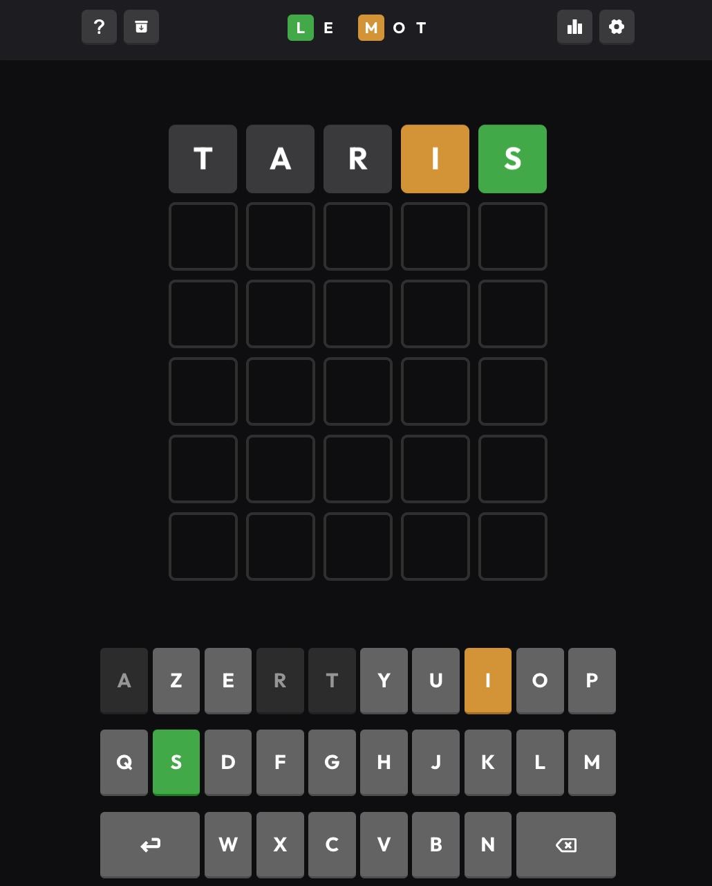

# wordlebot
This project propose a Wordle solver (french version)

## Introduction

This project is a golang version of [David Louapre's article](https://scienceetonnante.com/2022/02/13/comment-craquer-le-jeu-wordle-sutom/).

It uses a [french lexical database](http://www.lexique.org/) (140.000 words with frequency in movies or books).
It will select only the 4096 most frequent 5 letters words as a playground (`cmd/extract`).

Then it will compute the best first guess word (`cmd/first`)
And eventually for each game pattern, will provide the best new guess (`cmd/guess`)


## How to use it

1. Download lexical dabase
```
cd assets
curl -O http://www.lexique.org/databases/Lexique383/Lexique383.tsv
```

2. Parse tsv
```
go run cmd/extract/main.go -d -l assets/Lexique383.tsv
```

3. Compute the best word to start with
```
go run cmd/first/main.go -d -l assets/words.txt
```

4. Visualize a word statistics
```
go run cmd/chart/main.go -d -l assets/taris.stat
open bar.html
```

`event` Entropy processing for each possible results:


`ouche` Entropy processing for each possible results:


`taris` Entropy processing for each possible results:


1. Start a game

Start a game on your browser (https://wordle.louan.me/)



```
go run cmd/next/main.go -d -l assets/words.txt
```

Then use the words suggested by `wordlebot`


Et voila !


6. Run the game simulator (optional)

Use `-m 10` option to limit the simulation to 10 words to guess.

```
go run cmd/simulator/main.go -d -l assets/words.txt -m 10
INFO[0000] start with local words list assets/words.txt
DEBU[0024] Try to guess word gadjo                      
DEBU[0024]      [0] guess: taris result: 02000 
DEBU[0028]      [1] guess: lagon result: 02110 
DEBU[0028]      [2] guess: cargo result: 02012 
DEBU[0028]      [3] guess: gadjo result: 22222 
DEBU[0028] SUCCESS ✅ Found word gadjo in 4 attempts 
DEBU[0028] Try to guess word poter                      
DEBU[0028]      [0] guess: taris result: 10100 
DEBU[0029]      [1] guess: poter result: 22222 
DEBU[0029] SUCCESS ✅ Found word poter in 2 attempts 
DEBU[0029] Try to guess word calao                      
DEBU[0029]      [0] guess: taris result: 02000 
DEBU[0034]      [1] guess: lagon result: 12010 
DEBU[0034]      [2] guess: salto result: 02202 
DEBU[0034]      [3] guess: gallo result: 02212 
DEBU[0034]      [4] guess: balto result: 02202 
DEBU[0034]      [5] guess: calao result: 22222 
DEBU[0034] SUCCESS ✅ Found word calao in 6 attempts 
DEBU[0034] Try to guess word putti                      
DEBU[0034]      [0] guess: taris result: 10010 
DEBU[0035]      [1] guess: pinot result: 21001 
DEBU[0035]      [2] guess: parti result: 20022 
DEBU[0035]      [3] guess: putti result: 22222 
DEBU[0035] SUCCESS ✅ Found word putti in 4 attempts 
DEBU[0035] Try to guess word cajun                      
DEBU[0035]      [0] guess: taris result: 02000 
DEBU[0040]      [1] guess: lagon result: 02002 
DEBU[0041]      [2] guess: tarin result: 02002 
DEBU[0041]      [3] guess: salon result: 02002 
DEBU[0042]      [4] guess: marin result: 02002 
DEBU[0042]      [5] guess: galon result: 02002 
DEBU[0042] FAILURE ❌ Couldn't find word cajun in 6 attempts or less 
...
INFO[0033] wordlebot performance is 3.434783 attempts to guess a word
```

## References

* http://www.lexique.org/
* https://scienceetonnante.com/2022/02/13/comment-craquer-le-jeu-wordle-sutom/
* https://www.youtube.com/watch?v=iw4_7ioHWF4&t=569s
* https://www.youtube.com/watch?v=fRed0Xmc2Wg

## To do

* [ ] Add tests
* [ ] Speed up programs with concurency (especially simulator)
* [ ] Naming
* [ ] Improve charts